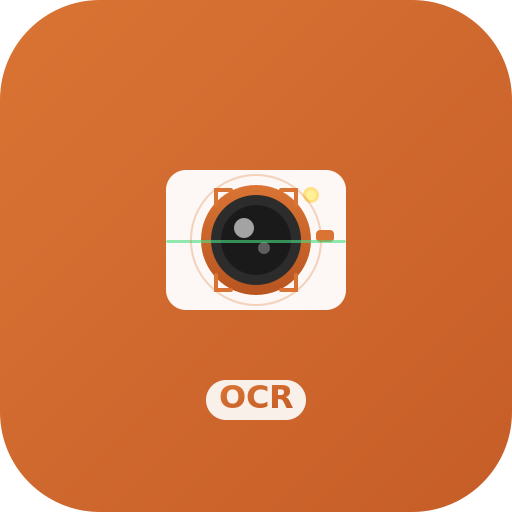

# Raycast OCR Extension

<p align="center">
  
</p>

<p align="center">A Raycast extension for quick text extraction from images, supporting multiple OCR engines.</p>

<p align="center">
  
  
  
</p>

## Features

- 🖼️ **OCR from Clipboard** - Extract text from copied images instantly
- 📸 **OCR from Screenshot** - Take screenshot and recognize text immediately
- 🔄 **Multi-Backend Support** - Switch freely between macOS Vision API, OpenAI Vision, and Google Gemini Vision
- 🚀 **Fast Response** - 2-5 seconds recognition speed with local Vision API
- 🌐 **Multi-Language Support** - Supports Chinese (Simplified/Traditional), English, and many other languages
- 🔒 **Privacy First** - Vision API processes completely offline, no network required
- 📋 **Auto Copy** - Recognition results automatically copied to clipboard
- ⚙️ **Flexible Configuration** - Easily configure and switch backends through extension preferences
- 🎨 **Independent Configuration** - Each backend's configuration is saved independently

## OCR Backend Comparison

| Feature | macOS Vision API | OpenAI Vision | Google Gemini Vision |
|---------|-----------------|---------------|---------------------|
| **Cost** | Free | Usage-based (~$0.01-0.03/image) | Usage-based (~$0.002-0.01/image) |
| **Network** | Offline | Internet required | Internet required |
| **Privacy** | Local processing | Uploaded to cloud | Uploaded to cloud |
| **Speed** | 2-5 seconds | 5-15 seconds | 3-8 seconds |
| **Accuracy** | 95%+ for printed text | Better for complex scenarios | Excellent for complex scenarios |
| **Languages** | 50+ languages | 100+ languages | 100+ languages |
| **Special Cases** | General | Better for handwriting, complex layouts | Multi-language mixed text, tables |
| **API Key Format** | None required | sk-... | AIza... |

## System Requirements

- macOS 10.15 or later
- Raycast application
- (Optional) OpenAI API Key (for OpenAI Vision backend)
- (Optional) Google Gemini API Key (for Gemini Vision backend)

## Installation

### Method 1: Install from Raycast Store (Recommended)

Once the extension is accepted to Raycast Store:

1. Open Raycast (`⌘ Space`)
2. Search for "Store"
3. Find "OCR Text Recognition"
4. Click Install

### Method 2: Manual Development Installation

1. Clone or download this project:
```bash
git clone https://github.com/Mieluoxxx/siriusx-raycast-ocr.git
cd siriusx-raycast-ocr
```

2. Install dependencies:
```bash
npm install
```

3. Run in Raycast development mode:
```bash
npm run dev
```

## Usage

### Method 1: Recognize from Clipboard

1. Copy or screenshot an image containing text
2. Open Raycast (default `⌘ Space`)
3. Type "OCR from Clipboard"
4. Press Enter to execute
5. Recognized text will be automatically copied to clipboard

### Method 2: Recognize from Screenshot

1. Open Raycast
2. Type "OCR from Screenshot"
3. Press Enter to execute
4. Raycast window will automatically hide
5. Select screen area to recognize
6. Recognized text will be automatically copied to clipboard

## Configure OCR Backend

### macOS Vision API (Default, Recommended)

**Advantages:**
- ✅ Free
- ✅ Completely offline
- ✅ Privacy secure
- ✅ Fast

**Use Cases:** Daily use, privacy-sensitive content, printed text

**Configuration:** None required, works out of the box

### OpenAI Vision (Optional)

**Advantages:**
- ✅ Higher accuracy in complex scenarios
- ✅ Better handwriting recognition
- ✅ Supports more languages
- ✅ Better at tables and complex layouts

**Disadvantages:**
- ⚠️ Paid (usage-based)
- ⚠️ Requires internet connection
- ⚠️ Images uploaded to cloud

**Use Cases:** Handwriting recognition, complex layouts, multi-language mixed text

**Configuration Steps:**

1. Open Raycast settings (`⌘ ,`)
2. Go to Extensions → OCR Text Recognition
3. Configure the following options:
   - **OCR Backend**: Select "OpenAI Vision"
   - **OpenAI API Key**: Enter your API Key (starts with `sk-`)
   - **API Endpoint**: (Optional) Custom endpoint, default `https://api.openai.com/v1`
   - **Model Name**: (Optional) Default `gpt-4o`
   - **Image Detail Level**:
     - `High` (Recommended, best OCR results)
     - `Auto` (Balanced)
     - `Low` (Faster but lower accuracy)

**Getting API Key:**

1. Visit [OpenAI Platform](https://platform.openai.com/)
2. Register/login to your account
3. Go to API Keys page
4. Create new API Key
5. Copy API Key and paste into Raycast settings

**Cost Estimation:**
- GPT-4o Vision: About $0.01-0.03/image
- 100 images per month: About $1-3
- See [OpenAI Pricing](https://openai.com/pricing) for details

### Using Third-Party Compatible APIs

If you use third-party services compatible with OpenAI format (like domestic proxy services):

1. Change **API Endpoint** to the third-party endpoint
2. Enter the corresponding API Key
3. Adjust **Model Name** according to service provider documentation

### Google Gemini Vision (Optional, Recommended)

**Advantages:**
- ✅ Lower cost (2-5 times cheaper than OpenAI)
- ✅ Faster speed
- ✅ Excellent multi-language mixed text recognition
- ✅ Strong table and complex document recognition

**Disadvantages:**
- ⚠️ Paid (usage-based)
- ⚠️ Requires internet connection
- ⚠️ Images uploaded to cloud

**Use Cases:** Cost-sensitive, multi-language mixed text, table recognition

**Configuration Steps:**

1. Open Raycast settings (`⌘ ,`)
2. Go to Extensions → OCR Text Recognition
3. Configure:
   - **OCR Backend**: Select "Google Gemini Vision"
   - **Gemini API Key**: Enter your API Key (starts with `AIza`)
   - **API Endpoint**: (Optional) Default `https://generativelanguage.googleapis.com/v1beta`
   - **Model Name**: (Optional) Default `gemini-2.5-flash`

**Getting API Key:**

1. Visit [Google AI Studio](https://makersuite.google.com/app/apikey)
2. Login with your Google account
3. Click "Create API Key"
4. Copy API Key and paste into settings

**Cost Estimation:**
- Gemini 2.5 Flash: About $0.002-0.01/image (2-5 times cheaper than OpenAI)
- 100 images per month: About $0.2-1
- See [Google AI Pricing](https://ai.google.dev/pricing) for details

## Keyboard Shortcuts

Recommended shortcuts in Raycast settings:

- **OCR from Clipboard**: `⌥ ⌘ V`
- **OCR from Screenshot**: `⌥ ⌘ C`

Setup method:
1. Open Raycast settings (`⌘ ,`)
2. Go to Extensions → OCR Text Recognition
3. Set keyboard shortcuts for each command

## Technical Architecture

### Backend Abstraction Layer
- **Interface Design**: Unified OCR backend interface (`IOCRBackend`)
- **Factory Pattern**: Dynamically create backend instances based on configuration
- **Error Handling**: Comprehensive error classification and user-friendly prompts

### Vision API Backend
- **Technology**: Swift + macOS Vision Framework
- **Bridge Method**: Node.js child_process
- **Timeout Control**: 30 seconds (including Swift compilation time)

### OpenAI VLM Backend
- **API**: OpenAI Chat Completions with Vision
- **Image Transfer**: Base64 encoding
- **Timeout Control**: 60 seconds
- **Prompt Optimization**: Optimized prompts for OCR scenarios

### Gemini VLM Backend
- **API**: Google Gemini API with Vision
- **Image Transfer**: Base64 encoding (inline_data format)
- **Timeout Control**: 60 seconds
- **Authentication**: x-goog-api-key Header
- **Default Model**: gemini-2.5-flash

### Configuration System
- **Storage**: LocalStorage + Raycast Preferences dual-layer configuration
- **Independent Configuration**: OpenAI and Gemini configurations stored independently
- **Visual Interface**: Form dynamically displays current backend configuration

## FAQ

### Why can't text be recognized?

- Ensure text in image is clear and visible
- Image resolution should not be too low
- Avoid text being too tilted or distorted
- Try switching to OpenAI backend

### What image formats are supported?

- **Vision API**: PNG, JPG, JPEG, GIF, BMP, TIFF, HEIC, etc.
- **OpenAI Vision**: PNG, JPEG, GIF, WebP

### How accurate is recognition?

- **Vision API**: 95%+ accuracy for clear printed text
- **OpenAI Vision**: Better for complex scenarios and handwriting

### What if OpenAI backend reports error?

| Error Message | Possible Cause | Solution |
|--------------|----------------|----------|
| API Key error | API Key invalid or not configured | Check API Key in Raycast settings |
| Quota exceeded | API quota exhausted or rate limit reached | Check OpenAI account balance or retry later |
| Network error | Cannot connect to API service | Check network connection or proxy settings |
| Request timeout | Image too large or network unstable | Try using smaller image or Vision API |

### Can it be used offline?

- **Vision API**: ✅ Completely offline
- **OpenAI Vision**: ❌ Requires internet connection
- **Gemini Vision**: ❌ Requires internet connection

### How to protect privacy?

**Using Vision API**:
- All processing done locally
- Images never leave your device
- No internet connection required

**Using OpenAI Vision**:
- Images uploaded to OpenAI servers
- Avoid recognizing sensitive content
- See [OpenAI Privacy Policy](https://openai.com/privacy)

**Using Gemini Vision**:
- Images uploaded to Google servers
- Avoid recognizing sensitive content
- See [Google AI Privacy Policy](https://ai.google.dev/terms)

### How to switch backends?

1. Open Raycast settings (`⌘ ,`)
2. Go to Extensions → OCR Text Recognition
3. Select in **OCR Backend** dropdown
4. Fill in corresponding API configuration
5. Takes effect immediately, no restart needed

### Gemini Backend Common Issues

**Issue**: Invalid API Key
- **Check**: Ensure API Key starts with `AIza`
- **Solution**: Recreate at [Google AI Studio](https://makersuite.google.com/app/apikey)

**Issue**: Quota exceeded
- **Cause**: Free quota exhausted or rate limit reached
- **Solution**: Check [Google Cloud Console](https://console.cloud.google.com/) quota settings

**Issue**: Slow recognition
- **Suggestion**: Gemini is usually faster than OpenAI, slowness might be network issue
- **Solution**: Check network connection or try using proxy

## Development

```bash
# Install dependencies
npm install

# Development mode
npm run dev

# Build
npm run build

# Code check
npm run lint

# Code format
npm run fix-lint
```

## Design Principles

This project follows these programming principles:

- **KISS**: Keep it simple, clear interfaces
- **SOLID**:
  - Single Responsibility (each backend independent)
  - Open-Closed (easy to extend new backends)
  - Dependency Inversion (depend on abstract interfaces)
- **DRY**: Unified error handling and configuration management
- **Type Safety**: Complete TypeScript type definitions

## Roadmap

- [x] macOS Vision API backend
- [x] OpenAI Vision backend
- [x] Google Gemini Vision backend
- [x] Multi-backend switching
- [x] Detailed error classification
- [ ] Google Cloud Vision backend
- [ ] Azure Computer Vision backend
- [ ] Local Tesseract OCR
- [ ] OCR history
- [ ] Batch recognition
- [ ] Result editing and correction

## License

MIT License

## Contributing

Issues and Pull Requests are welcome!

## Acknowledgments

- [Raycast](https://raycast.com/) - Excellent macOS launcher
- [OpenAI](https://openai.com/) - Powerful AI capabilities
- Apple Vision Framework - Local OCR engine
