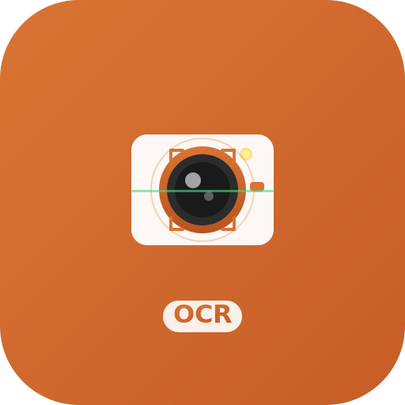

<p align="center">
  
</p>

<h1 align="center">Raycast OCR Extension</h1>

<p align="center">从图片中快速提取文字的 Raycast 扩展，支持多种 OCR 引擎。</p>

<p align="center">
  
  
  
</p>

## 功能特性

- 🖼️ **识别剪贴板图片** - 复制图片后一键识别文字
- 📸 **截图识别** - 截取屏幕区域并立即识别文字
- 🔄 **多后端支持** - 在 macOS Vision API、OpenAI Vision 和 Google Gemini Vision 之间自由切换
- 🚀 **快速响应** - 本地 Vision API 识别速度 2-5 秒
- 🌐 **多语言支持** - 支持中文(简体/繁体)、英文等多种语言
- 🔒 **隐私优先** - Vision API 完全离线处理，无需网络
- 📋 **自动复制** - 识别结果自动复制到剪贴板
- ⚙️ **灵活配置** - 通过可视化界面轻松配置和切换后端
- 🎨 **独立配置** - 每个后端的配置独立保存，切换无忧

## OCR 后端对比

| 特性 | macOS Vision API | OpenAI Vision | Google Gemini Vision |
|------|-----------------|---------------|---------------------|
| **成本** | 免费 | 按使用量计费 (~$0.01-0.03/图) | 按使用量计费 (~$0.002-0.01/图) |
| **网络** | 离线 | 需要网络连接 | 需要网络连接 |
| **隐私** | 本地处理 | 上传到云端 | 上传到云端 |
| **速度** | 2-5秒 | 5-15秒 | 3-8秒 |
| **准确率** | 印刷体 95%+ | 复杂场景更优 | 复杂场景优秀 |
| **语言支持** | 50+ 种语言 | 100+ 种语言 | 100+ 种语言 |
| **特殊场景** | 一般 | 手写、复杂排版更好 | 多语言混排、表格识别 |
| **API Key 格式** | 无需 | sk-... | AIza... |

## 系统要求

- macOS 10.15 或更高版本
- Raycast 应用
- （可选）OpenAI API Key（用于 OpenAI Vision 后端）
- （可选）Google Gemini API Key（用于 Gemini Vision 后端）

## 安装

### 方式 1: 从 Raycast Store 安装 (推荐)

一旦插件被接受到 Raycast Store，你可以：

1. 打开 Raycast (`⌘ Space`)
2. 搜索 "Store"
3. 找到 "OCR Text Recognition"
4. 点击安装

### 方式 2: 手动开发安装

1. 克隆或下载本项目:
```bash
git clone https://github.com/Mieluoxxx/siriusx-raycast-ocr.git
cd siriusx-raycast-ocr
```

2. 安装依赖:
```bash
pnpm install
```

3. 在 Raycast 中开发模式运行:
```bash
pnpm dev
```

## 使用方法

### 方法 1: 识别剪贴板图片

1. 复制或截图一张包含文字的图片
2. 打开 Raycast (默认 `⌘ Space`)
3. 输入 "OCR from Clipboard" 或 "识别剪贴板"
4. 按回车执行
5. 识别的文字会自动复制到剪贴板

### 方法 2: 截图识别

1. 打开 Raycast
2. 输入 "OCR from Screenshot" 或 "截图识别"
3. 按回车执行
4. Raycast 窗口会自动隐藏
5. 选择要识别的屏幕区域
6. 识别的文字会自动复制到剪贴板

### 方法 3: 查看和配置 OCR 设置

1. 打开 Raycast
2. 输入 "Configure OCR" 或 "配置 OCR"
3. 查看当前配置和后端状态
4. 快速访问扩展设置
5. 验证后端配置是否正常

## 配置 OCR 后端

### 查看和配置 OCR 后端

运行 `Configure OCR` 命令可以：
- ✅ 在可视化界面中直接配置所有后端
- ✅ 切换后端（Vision API / OpenAI / Gemini）
- ✅ 填写和修改 API Key、端点、模型等配置
- ✅ 各后端配置独立保存，切换不丢失
- ✅ 一键保存配置，立即生效

### macOS Vision API（默认，推荐）

**优点：**
- ✅ 免费
- ✅ 完全离线
- ✅ 隐私安全
- ✅ 速度快

**适用场景：** 日常使用、隐私敏感内容、印刷体文字

**配置：** 无需配置，开箱即用

### OpenAI Vision（可选）

**优点：**
- ✅ 复杂场景准确率更高
- ✅ 更好的手写识别
- ✅ 支持更多语言
- ✅ 表格和复杂排版识别更好

**缺点：**
- ⚠️ 需要付费（按使用量）
- ⚠️ 需要网络连接
- ⚠️ 图片上传到云端

**适用场景：** 手写识别、复杂排版、多语言混合

**配置步骤：**

1. 打开 Raycast 设置 (`⌘ ,`)
2. 进入 Extensions → OCR Text Recognition
3. 配置以下选项：
   - **OCR Backend**: 选择 "OpenAI Vision"
   - **OpenAI API Key**: 输入你的 API Key (以 `sk-` 开头)
   - **API Endpoint**: (可选) 自定义端点，默认 `https://api.openai.com/v1`
   - **Model Name**: (可选) 默认 `gpt-4o`
   - **Image Detail Level**:
     - `High` (推荐，最佳 OCR 效果)
     - `Auto` (平衡)
     - `Low` (快速但精度较低)

**获取 API Key：**

1. 访问 [OpenAI Platform](https://platform.openai.com/)
2. 注册/登录账号
3. 进入 API Keys 页面
4. 创建新的 API Key
5. 复制 API Key 并粘贴到 Raycast 设置中

**成本估算：**
- GPT-4o Vision: 约 $0.01-0.03/图片
- 每月识别 100 张图：约 $1-3
- 详细定价请查看 [OpenAI Pricing](https://openai.com/pricing)

### 使用第三方兼容 API

如果你使用支持 OpenAI 格式的第三方服务（如国内的各种代理服务），可以：

1. 将 **API Endpoint** 改为第三方端点
2. 输入对应的 API Key
3. 根据服务商文档调整 **Model Name**

### Google Gemini Vision（可选，推荐）

**优点：**
- ✅ 成本更低（比 OpenAI 便宜 2-5 倍）
- ✅ 速度较快
- ✅ 多语言混排识别优秀
- ✅ 表格和复杂文档识别能力强

**缺点：**
- ⚠️ 需要付费（按使用量）
- ⚠️ 需要网络连接
- ⚠️ 图片上传到云端

**适用场景：** 成本敏感、多语言混排、表格识别

**配置步骤：**

1. 打开 Raycast，输入 "Configure OCR"
2. 选择 **Google Gemini Vision** 🌟
3. 配置以下选项：
   - **API Key**: 输入你的 Gemini API Key (以 `AIza` 开头)
   - **API 端点**: (可选) 默认 `https://generativelanguage.googleapis.com/v1beta`
   - **模型名称**: (可选) 默认 `gemini-2.5-flash`
4. 点击保存

**获取 API Key：**

1. 访问 [Google AI Studio](https://makersuite.google.com/app/apikey)
2. 登录你的 Google 账号
3. 点击 "Create API Key"
4. 复制 API Key 并粘贴到配置界面

**成本估算：**
- Gemini 2.5 Flash: 约 $0.002-0.01/图片（比 OpenAI 便宜 2-5 倍）
- 每月识别 100 张图：约 $0.2-1
- 详细定价请查看 [Google AI Pricing](https://ai.google.dev/pricing)

## 快捷键设置

建议在 Raycast 设置中为这两个命令配置快捷键，例如:

- **OCR from Clipboard**: `⌥ ⌘ V`
- **OCR from Screenshot**: `⌥ ⌘ C`

设置方法:
1. 打开 Raycast 设置 (`⌘ ,`)
2. 进入 Extensions → OCR Text Recognition
3. 为每个命令设置快捷键

## 技术架构

### 后端抽象层
- **接口设计**: 统一的 OCR 后端接口（`IOCRBackend`）
- **工厂模式**: 根据配置动态创建后端实例
- **错误处理**: 完善的错误分类和用户友好提示

### Vision API 后端
- **技术栈**: Swift + macOS Vision Framework
- **桥接方式**: Node.js child_process
- **超时控制**: 30 秒（包含 Swift 编译时间）

### OpenAI VLM 后端
- **API**: OpenAI Chat Completions with Vision
- **图片传输**: Base64 编码
- **超时控制**: 60 秒
- **Prompt 优化**: 针对 OCR 场景优化的提示词

### Gemini VLM 后端
- **API**: Google Gemini API with Vision
- **图片传输**: Base64 编码（inline_data 格式）
- **超时控制**: 60 秒
- **认证方式**: x-goog-api-key Header
- **默认模型**: gemini-2.5-flash

### 配置系统
- **存储方式**: LocalStorage + Raycast Preferences 双层配置
- **独立配置**: OpenAI 和 Gemini 配置独立存储，切换不丢失
- **可视化界面**: Form 表单动态显示当前后端配置

### 目录结构

```
src/
├── backends/
│   ├── types.ts           # 类型定义和接口
│   ├── factory.ts         # 后端工厂
│   ├── vision-api.ts      # Vision API 后端
│   ├── openai-vlm.ts      # OpenAI VLM 后端
│   └── gemini-vlm.ts      # Gemini VLM 后端
├── utils/
│   ├── clipboard.ts       # 剪贴板和截图工具
│   ├── config.ts          # 配置管理
│   └── vision-ocr.ts      # Vision API Swift 桥接
├── ocr-from-clipboard.tsx # 剪贴板 OCR 命令
├── ocr-from-screenshot.tsx # 截图 OCR 命令
└── configure-ocr.tsx      # 配置界面命令
```

## 常见问题

### 为什么识别不到文字?

- 确保图片中的文字清晰可见
- 图片分辨率不要太低
- 避免文字过于倾斜或变形
- 尝试切换到 OpenAI 后端试试

### 支持哪些图片格式?

- **Vision API**: PNG, JPG, JPEG, GIF, BMP, TIFF, HEIC 等
- **OpenAI Vision**: PNG, JPEG, GIF, WebP

### 识别准确率如何?

- **Vision API**: 清晰印刷体 95%+ 准确率
- **OpenAI Vision**: 复杂场景和手写体更优

### OpenAI 后端报错怎么办?

| 错误提示 | 可能原因 | 解决方法 |
|---------|---------|---------|
| API Key 错误 | API Key 无效或未配置 | 检查 Raycast 设置中的 API Key |
| 配额超限 | API 配额用尽或达到速率限制 | 检查 OpenAI 账户余额或稍后重试 |
| 网络错误 | 无法连接到 API 服务 | 检查网络连接或代理设置 |
| 请求超时 | 图片过大或网络不稳定 | 尝试使用更小的图片或 Vision API |

### 可以离线使用吗?

- **Vision API**: ✅ 完全离线
- **OpenAI Vision**: ❌ 需要网络连接
- **Gemini Vision**: ❌ 需要网络连接

### 如何保护隐私?

**使用 Vision API**:
- 所有处理都在本地完成
- 图片不会离开你的设备
- 不需要网络连接

**使用 OpenAI Vision**:
- 图片会上传到 OpenAI 服务器
- 请避免识别敏感内容
- 详见 [OpenAI 隐私政策](https://openai.com/privacy)

**使用 Gemini Vision**:
- 图片会上传到 Google 服务器
- 请避免识别敏感内容
- 详见 [Google AI 隐私政策](https://ai.google.dev/terms)

### 如何切换后端?

**方法 1: 使用配置界面（推荐）**
1. 打开 Raycast，输入 "Configure OCR"
2. 选择想要的后端（Vision API / OpenAI / Gemini）
3. 填写对应的配置（API Key 等）
4. 点击保存，立即生效

**方法 2: 使用 Raycast 设置**
1. 打开 Raycast 设置 (`⌘ ,`)
2. Extensions → OCR Text Recognition
3. 在 **OCR Backend** 下拉框中选择
4. 填写对应的 API 配置
5. 无需重启，立即生效

### Gemini 后端常见问题

**问题**: API Key 无效
- **检查**: 确保 API Key 以 `AIza` 开头
- **解决**: 在 [Google AI Studio](https://makersuite.google.com/app/apikey) 重新创建

**问题**: 配额超限
- **原因**: 免费配额用尽或达到速率限制
- **解决**: 检查 [Google Cloud Console](https://console.cloud.google.com/) 配额设置

**问题**: 识别速度慢
- **建议**: Gemini 通常比 OpenAI 快，如果慢可能是网络问题
- **解决**: 检查网络连接或尝试使用代理

## 开发

```bash
# 安装依赖
pnpm install

# 开发模式
pnpm dev

# 构建
pnpm build

# 代码检查
pnpm lint

# 代码格式化
pnpm fix-lint
```

## 设计原则

本项目遵循以下编程原则:

- **KISS**: 保持简单，接口清晰
- **SOLID**:
  - 单一职责（每个后端独立）
  - 开闭原则（易于扩展新后端）
  - 依赖倒置（依赖抽象接口）
- **DRY**: 统一的错误处理和配置管理
- **类型安全**: 完整的 TypeScript 类型定义

## 路线图

- [x] macOS Vision API 后端
- [x] OpenAI Vision 后端
- [x] Google Gemini Vision 后端
- [x] 多后端切换
- [x] 详细错误分类
- [x] 可视化配置界面
- [x] 独立配置存储
- [ ] Google Cloud Vision 后端
- [ ] Azure Computer Vision 后端
- [ ] 本地 Tesseract OCR
- [ ] OCR 历史记录
- [ ] 批量识别
- [ ] 结果编辑和校正

## 许可证

MIT License

## 贡献

欢迎提交 Issue 和 Pull Request!

## 致谢

- [Raycast](https://raycast.com/) - 优秀的 macOS 启动器
- [OpenAI](https://openai.com/) - 强大的 AI 能力
- Apple Vision Framework - 本地 OCR 引擎
